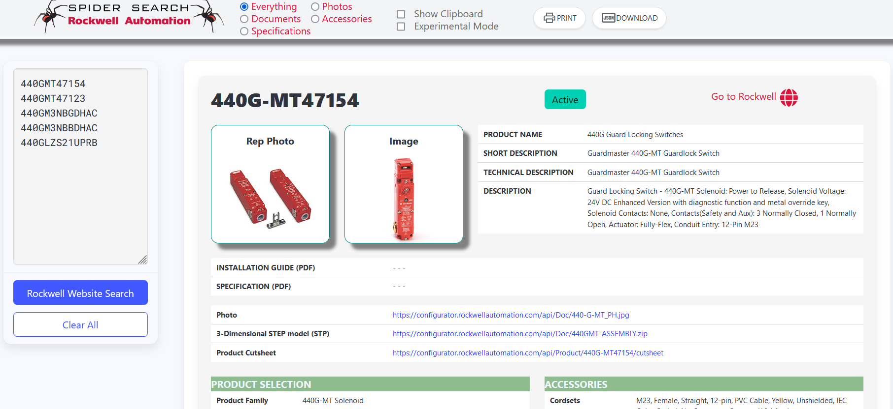

# Rockwell-Automation-Bulk-Search
Bulk searching item numbers _item numbers_ of the [Rockwell Automation]([https://www.nhp.com.au](https://www.rockwellautomation.com/en-us.html)) website.

Bulk search product item numbers.

Quickly find a product items:
* Specifications
* Photos
* Technical Documents
* CAD drawings
* Accessories
* Lifecycle status
* Bulk download CAD drawings - CAD file types and ZIP/PDF (includes a list in a CSV file)
* Bulk download PDF Documents (includes a list in a  CSV file)
* ... more

Easily PRINT a fully optimised interactive PDF.

## Requirements
Firefox browser.

This is a *temporary* installed extension for Firefox only.

Uses the _new-tab_ extension feature. It will appear whenever you create a _new-tab_.

For the geeks looking at the code, its powered by Manifest 2.

## Installing

1. Download as a ZIP.
2. Unzip contents to a folder.
3. Open Firefox browser
4. Go to Firefox menu hamburger
5. Select "Settings"
6. Click on "Extensions and Themes"
7. Click on the _cog_ icon.
8. Select 'Debug Addons'
9. Select 'Load Temporary Addon'
10. Select the folder you unzipped the contents into a select any file in the folder and click "Open"
11. The extension will now be loaded.

Anytime you click the new tab "+" in firefox, this extension will appear.

## CAD Downloads

If CAD drawings exist the "CAD Download" button will appear.
- Will export CAD file types as well as PDF drawings.
- CSV file is genenerated that lists the Rockwell item numbers and its link to the CAD.
- Downloads are 1 second apart (depending on the file size)

## Document Downloads

If "General" documents exist the "Document Download" button will appear.
- Will export Document PDF file types only
- CSV file is genenerated that lists the Rockwell item numbers and its link to the document.
- Other things are listed in the CSV file (e.g. PODCAST urls, as well cutsheets)
- Downloads are 1 second apart (depending on the file size)

## Using JSON file in EXCEL

1. In a new book in MS Excel, select the DATA tab.
   
   Click "Get Data" and select "From File" and "From JSON".
   
   Select the JSON file you want to import.

2. Select "To Table"

3. Select "To Table"

