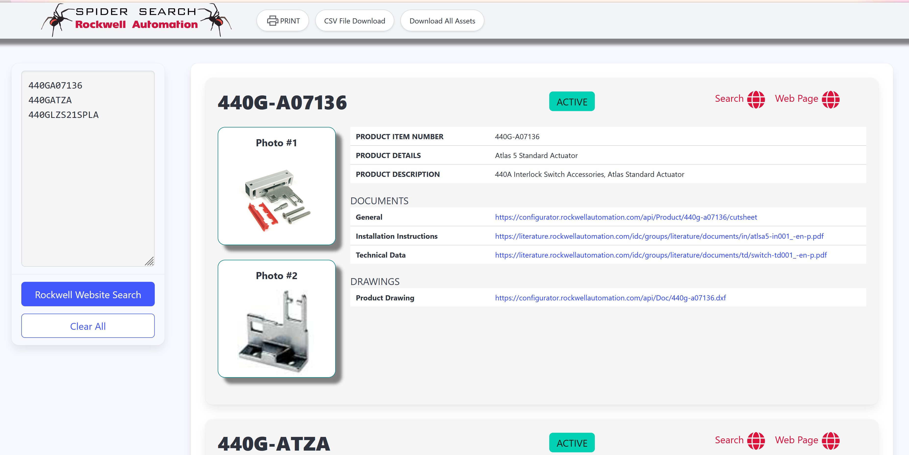
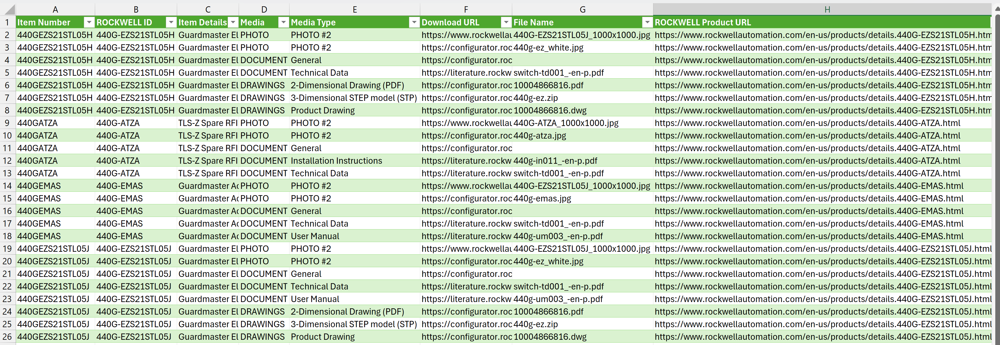
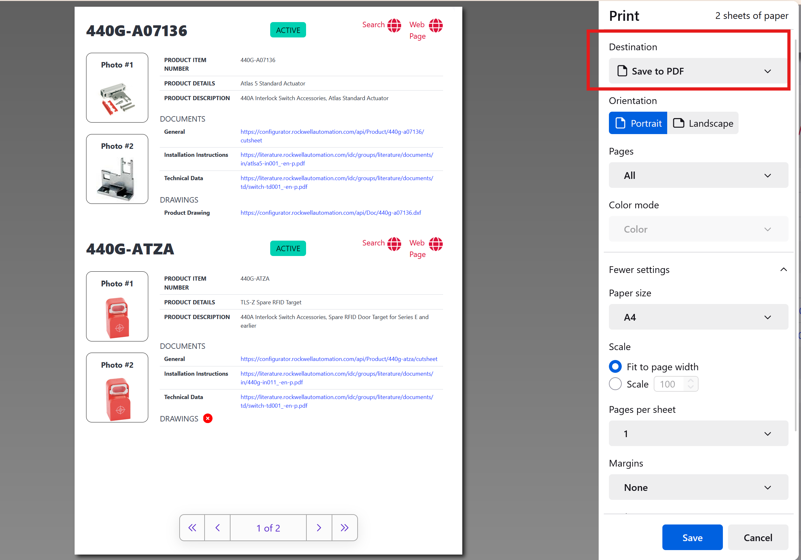
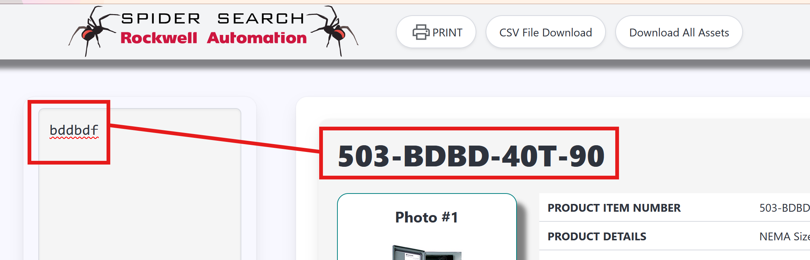

# Rockwell-Automation-Bulk-Search
Bulk searching item numbers _item numbers_ of the [Rockwell Automation]([https://www.nhp.com.au](https://www.rockwellautomation.com/en-us.html)) website.

v2.0 (current version) update saw a lot of previous avilable functioning removed due to changes in the Rockwell API.

* Photos
* Technical Documents
* CAD drawings
* Lifecycle status

Easily:
* Download a CSV file report
* Bulk download all the assets.
* PRINT a fully _interactive_ PDF.

## Requirements
Firefox browser.

This is a *temporary* installed extension for Firefox only.

Uses the _new-tab_ extension feature. It will appear whenever you create a _new-tab_.

For the geeks looking at the code, its powered by Manifest 2.

## Installing

1. Download as a ZIP.
2. Unzip contents to a folder.
3. Open Firefox browser
4. Go to Firefox menu hamburger
5. Select "Settings"
6. Click on "Extensions and Themes"
7. Click on the _cog_ icon.
8. Select 'Debug Addons'
9. Select 'Load Temporary Addon'
10. Select the folder you unzipped the contents into a select any file in the folder and click "Open"
11. The extension will now be loaded.

Anytime you click the new tab "+" in firefox, this extension will appear.

## Download a CSV File

A CSV file report can be generated of the search results.

Pressing the "CSV File Download" button downloads the CSV file to your Downloads folder (PC).
- CSV file is "|" (pipe) seperated.

In Excel use Data -> From Text/CSV then select import your CSV file.
Select "Transform Data" then click on "Use First Row as Header", then click "Close & Load".

## Download All Assets

If assets like photos, diagrams and documents exist the "Download All Assets" button will appear.
- Will download assets into your Downloads folder (PC)
- Downloads are 1 second apart (depending on the file size)

## PRINT an interactive PDF

An interactive PDF file can be generated from the search results.
Press the "PRINT" button and select 'Save to PDF' as the Destination.
- all website interactivity is embedded in the PDF (links work)

## Watch out for ....

_The Rockwell website search uses a 'score' to rate what it finds, and may not find what you actually searched for but something it believe you may have been looking for.
Be wary that this can happen.
We recommend you export the CSV file when doing mass searchs as the item number you search for, and the Rockwell item number are both included for comparison._

